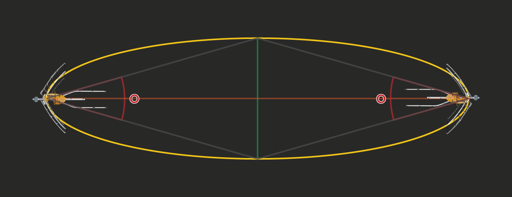
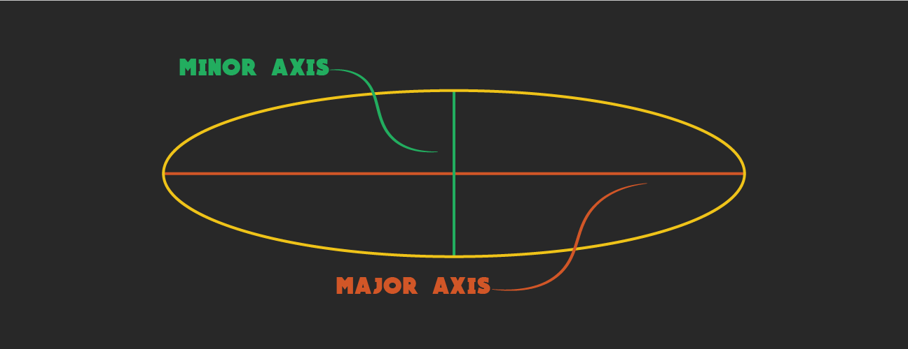
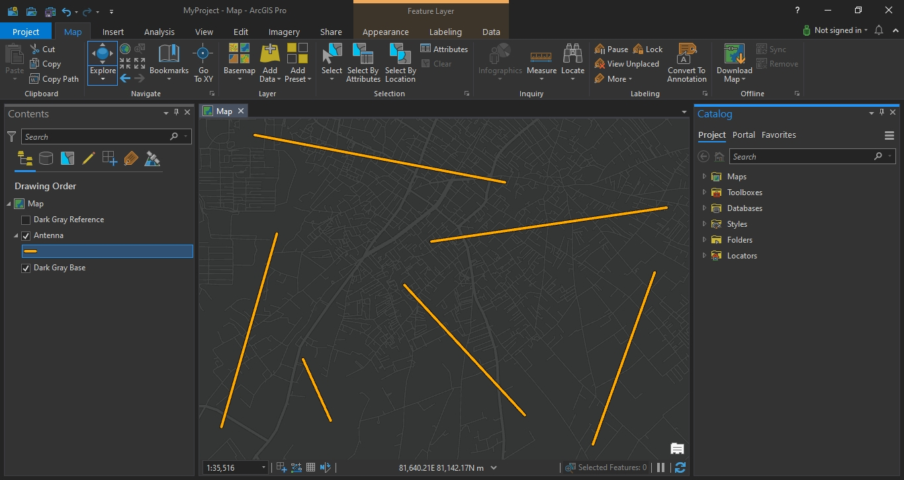
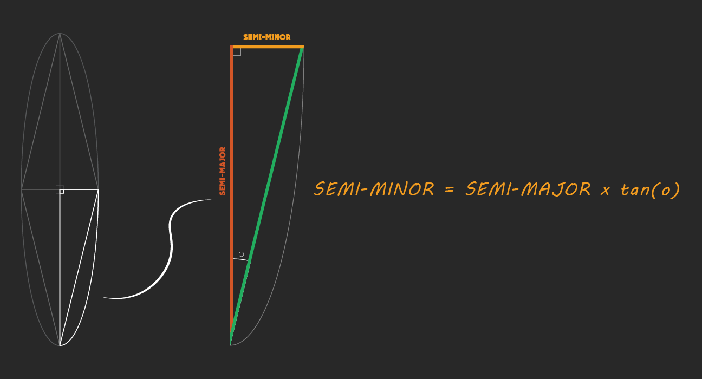

# create the areas covered by antenna ellipse
### Overview
To know area covered by ellipse antenna I did my analysis that which I am about to explain to you.
look at The image below that contain a diagram to a pair antenna that  show how to the antenna does cover to the areas.



The best shape to ellipse antenna's covered area is a ellipse 'that is clear from his name' so I would to show axes to ellipse, there are two axes Major-axis and Minor-axis as the below image.



The lines exsist at in bellow image are links between each a pair of antenna, in the same time each a line is a major axis to ellipse that going to create by the code.



the code workflow is calculate the semi-minor axis length that does create from multiplying tangent of angle with semi-major axis length  then multiplying that with two to calculate minor axis.



```py
import os
import geopandas as gpd
import math
import shutil
from shapely.geometry import Polygon
from matplotlib.patches import Ellipse
```

```py
data = gpd.read_file(r'../training_lm.gdb',driver="OpenFileGDB",layer="mtit_LM15GH_jaw")
```


```py
def azimuthAngle(x1,y1,x2,y2):
  angle = 0.0;
  dx = x2 - x1
  dy = y2 - y1
  if x2 == x1:
    angle = math.pi / 2.0
    if y2 == y1 :
      angle = 0.0
    elif y2 < y1 :
      angle = 3.0 * math.pi / 2.0
  elif x2 > x1 and y2 > y1:
    angle = math.atan(dx / dy)
  elif x2 > x1 and y2 < y1 :
    angle = math.pi / 2 + math.atan(-dy / dx)
  elif x2 < x1 and y2 < y1 :
    angle = math.pi + math.atan(dx / dy)
  elif x2 < x1 and y2 > y1 :
    angle = 3.0 * math.pi / 2.0 + math.atan(dy / -dx)
  return (angle * 180 / math.pi)
```

```py
semi_minor = lambda length,degree : (length/2)*math.tan(math.radians(degree))
```

```py
def create_ellipse(gdf,degree):
    ellipse_list = list()
    for inx in gdf.index:
        ellipse_graph = Ellipse((data.iloc[inx]['geometry'].centroid.x,data.iloc[inx]['geometry'].centroid.y),semi_minor(data.iloc[inx]['geometry'].length,degree/2)*2,data.iloc[inx]['geometry'].length,(360-azimuthAngle(data.iloc[inx]['geometry'].centroid.x,data.iloc[inx]['geometry'].centroid.y,data.iloc[inx]['geometry'].coords[-1][0],data.iloc[inx]['geometry'].coords[-1][1])))
        ellipse_shape = Polygon(ellipse_graph.get_verts())
        ellipse_list.append(ellipse_shape)
    return ellipse_list
```

```py
data['geometry'] = create_ellipse(data,5)
```

```py
if os.path.isdir('output'):
    shutil.rmtree('output',ignore_errors=True)
os.mkdir('output')
data.to_file(r'output\output.shp')
```
