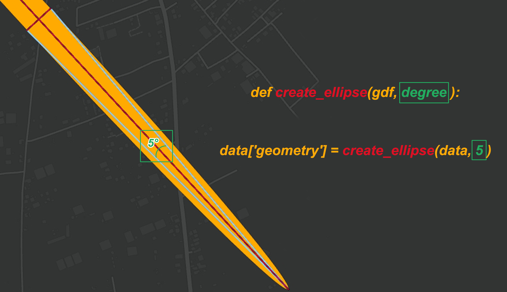

# create ellipse from line that link between two antenna to find  area covered that has best signal from antenna.
To know area covered by ellipse antenna I did my analysis that which I am about to explain to you.
look at The image below that contain a diagram to a pair antenna that  show how to the antenna does cover to the areas.


The best shape to ellipse antenna's covered area is a ellipse 'that is clear from his name' so I would to show axes to ellipse, there are two axes Major-axis and Minor-axis as the below image.


The lines exsist at in bellow image are links between each a pair of antenna, in the same time each a line is a major axis to ellipse that going to create by the code.


the code workflow is create ellipse by ***matplotlib.patches.Ellipse(xy, width, height, angle)***

| parameter   | Description                                                             |
| ----------- | ----------------------------------------------------------------------- |
| xy          | xy coordinates of ellipse centre 'center of the line given above'       |
| width       | Total length (diameter) of Major-axis 'Length of the line given above'  |
| height      | Total length (diameter) of Minor-axis                                   |
| angle       | Rotation in degrees anti-clockwise                                      |

to calculate the semi-minor axis length by multiplying tangent of angle with semi-major axis length  then multiplying that with two to calculate minor axis as a below image.


the angle will calculate by ***azimuthAngle(x1,y1,x2,y2)*** that calculate Azimuth angle between center of line 'xy parameter' and the last vertex in the line
# 
```py
import os
import geopandas as gpd
import math
import shutil
from shapely.geometry import Polygon
from matplotlib.patches import Ellipse
```
**read data from Esri Geodatabase**
```py
data = gpd.read_file(r'MyProject.gdb',driver="OpenFileGDB",layer="Antenna")
```
**azimuthAngle function that was mentioned above**
```py
def azimuthAngle(x1,y1,x2,y2):
    angle = 0.0;
    dx = x2 - x1
    dy = y2 - y1
    if x2 == x1:
        angle = math.pi / 2.0
        if y2 == y1 :
            angle = 0.0
        elif y2 < y1 :
            angle = 3.0 * math.pi / 2.0
    elif x2 > x1 and y2 > y1:
        angle = math.atan(dx / dy)
    elif x2 > x1 and y2 < y1 :
        angle = math.pi / 2 + math.atan(-dy / dx)
    elif x2 < x1 and y2 < y1 :
        angle = math.pi + math.atan(dx / dy)
    elif x2 < x1 and y2 > y1 :
        angle = 3.0 * math.pi / 2.0 + math.atan(dy / -dx)
    return (angle * 180 / math.pi)
```
**find semi-minor axis length**
```py
semi_minor = lambda length,degree : (length/2)*math.tan(math.radians(degree))
```
**create ellipse using functions that was written above**
```py
def ellipse(geom,degree):
    length = geom.length/2
    width  = semi_minor(length,degree)
    x1,y1  = (geom.centroid.x,geom.centroid.y)
    x2,y2 = geom.coords[-1]
    angle = 360-azimuthAngle(x1,y1,x2,y2)
    g = Ellipse((x1,y1),width, length, angle)
    polygon = Polygon(g.get_verts())
    return polygon
```
```py
new_geom = data.geometry.apply(ellipse,degree=5)
data.set_geometry(new_geom,drop=True,inplace=True)
```

**create Esri Shapefile contains ellipse**
```py
if os.path.isdir('output'):
    shutil.rmtree('output',ignore_errors=True)
os.mkdir('output')
data.to_file(r'output\output.shp')
```



